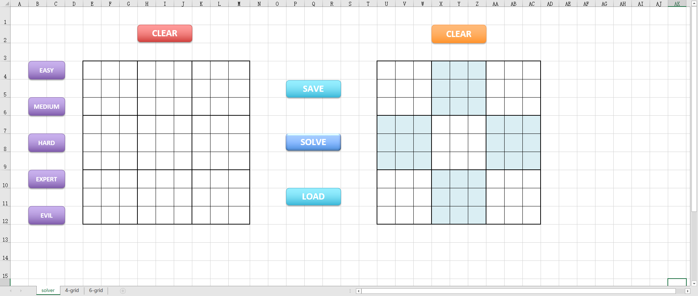

# sudoku-solver-and-generator
a sudoku solver and generator using excel vba and python(xlwings)

## Background

Sudoku is a popular game all over the world. Both adults and children can have endless fun from this game. Some Sudokus are very challenging and often take hours or even days to solve. But these Sudokus are very simple if they are solved by a computer, so many enthusiasts use various programming languages to implement some Sudoku solvers as an aid for them to solve Sudoku puzzles. In addition, in order to create more interesting Sudoku puzzles, we can generate some Sudoku based on some specific algorithm. The usual requirement is that these Sudokus must be valid and have only one solution.

There are already many Sudoku solvers and generators on the web, but why not add another one? I used Excel VBA and python to write this Sudoku solver and generator. Excel is mainly used as the front end of this application, and python is mainly used as the back end, using the famous [*dancing links*](https://en.wikipedia.org/wiki/Dancing_Links) algorithm to solve Sudoku. According to my test, most of Sudoku can be solved in about a second, even the most difficult Sudoku. I created this project mainly to practice my VBA and python programming skills. I found that the combination of Excel and python can create many interesting applications. Maybe in the future I will use this method to create more interesting applications.

## Algorithm

The most commonly used algorithm to solve Sudoku with a computer is the backtracking method, but the backtracking method often takes a lot of time for those particularly difficult Sudokus, or even completely unable to solve them. Another method that can be used is the linear programming method, which converts the Sudoku problem into a linear programming problem, and then uses linear programming-related algorithms to solve it. For an introduction to using linear programming to solve Sudoku, please refer to [this article](https://towardsdatascience.com/using-integer-linear-programming-to-solve-sudoku-puzzles-15e9d2a70baa). In python, we can use [**PuLP**](https://coin-or.github.io/pulp/) to solve integer linear programming problems.

In addition to the above two methods, there is a theoretically more efficient and general algorithm, which is to convert Sudoku into an *[exact cover problem](https://en.wikipedia.org/wiki/Exact_cover)*. The exact cover problem is a classic problem in computer science. Many difficult problems, such as pentomino tiling, Sudoku and N-queen problems, can be transformed into exact cover problems. In order to solve the exact cover problem, computer scientist *Donald Knuth* proposed the dancing links algorithm in a paper in 2000. *Dancing links* is a technique for reverting the operation of deleting a node from a circular doubly linked list. It is particularly useful for efficiently implementing backtracking algorithms, such as Donald Knuth's Algorithm X for the exact cover problem. Algorithm X is a recursive, nondeterministic, depth-first, backtracking algorithm that finds all solutions to the exact cover problem. 

In this project, I borrowed a [python implementation](https://www.cs.mcgill.ca/~aassaf9/python/algorithm_x.html) of dancing links algorithm. The main idea of the implementation is to use dictionnaries instead of doubly-linked lists to represent the exact cover matrix.  The whole implementation is very concise and efficient, with only about 30 lines of code. I use it to solve [project euler problem 96](https://projecteuler.net/problem=96), and it takes less than 221ms to get 50 Sudoku solutions.

## Installtion

First of all, make sure you install the python library `xlwings`. If it is not installed, you can refer to *[this page](https://docs.xlwings.org/en/stable/installation.html)* to install. Apart from that, you no longer need to install anything. After that, you can download this project and open the `sudoku.xlsm` file to start using it. 

## Usage

The overall interface looks like this:

The three sheets contain three Sudoku solvers, namely 9\*9 Sudoku, 4\*4 Sudoku and 6\*6 Sudoku. For the 9*9 Sudoku, you can click the five buttons on the left to generate Sudokus of five different difficulty. These Sudokus are verified to be valid and have unique solutions. These sudokus come from different sudoku databases, from which I have collected about **40,000** sudokus, which appear randomly each time they are generated. Sudoku data is contained in the `puzzles` folder. You can refer to [this page](https://github.com/t-dillon/tdoku/blob/master/benchmarks/README.md) for more detailed Sudoku collections.

After generating a Sudoku or entering a Sudoku puzzle yourself, you can click the solve button in the middle to solve the Sudoku, and the answer will be displayed in the Sudoku box on the right.After solving Sudoku, you can click the clear button above to clear the puzzle and solution. For some Sudoku that you particularly like, you can click the save button to save it to a file, and then click the load button to load the Sudoku when you need, so that you don't have to enter numbers repeatedly.As for 4-grid sudoku and 6-grid sudoku, except that there is no function of generating, saving and loading Sudoku, other functions are exactly the same as 9-grid sudoku.

Hope you enjoy it!

## License

This project falls under the GNU General Public License v3.0.

